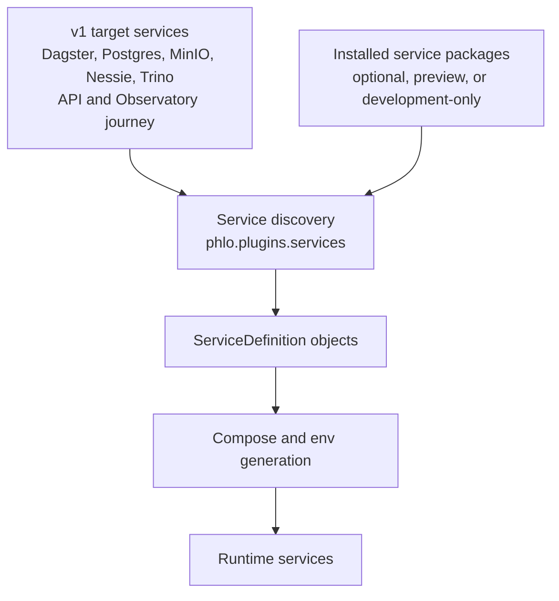

# Service Packages

Phlo services are distributed as Python packages. Each service package ships its own `service.yaml`
definition and registers a `phlo.plugins.services` entry point for CLI discovery.

## Architecture

Phlo services are organized into the v1 target profile and separately installed optional or preview services:



### v1 Target Services

The v1 target stack is installed with `phlo[defaults]`; the base `phlo` package does not install every provider. Current maturity and release-gate status are recorded in [the support manifest](../../registry/support/v1.json):

- **Dagster, PostgreSQL, MinIO, Nessie, and Trino** - the tested local service path
- **phlo-api and Observatory** - the core product surface, with an authenticated durable per-run report API and UI projection implemented at alpha maturity

### Package Services

Package services are installed separately and can be swapped for alternatives:

```bash
# Install default services (recommended)
pip install phlo[defaults]

# Or install individually
pip install phlo-dagster phlo-postgres phlo-trino
```

Default package services:

- `phlo-dagster` - Data orchestration platform
- `phlo-postgres` - PostgreSQL for Dagster metadata
- `phlo-minio` - S3-compatible object storage
- `phlo-nessie` - Git-like catalog for Iceberg
- `phlo-trino` - Distributed SQL query engine

Optional packages:

- `phlo-superset` - Business intelligence
- `phlo-pgweb` - PostgreSQL web admin
- `phlo-postgrest` - Auto-generated REST API
- `phlo-hasura` - GraphQL API
- `phlo-clickstack` - All-in-one observability backend [observability]
- `phlo-prometheus` - Metrics [observability]
- `phlo-grafana` - Dashboards [observability]
- `phlo-loki` - Log aggregation [observability]
- `phlo-alloy` - Log shipping [observability]

## Customizing Services

Override service settings in your `phlo.yaml`:

```yaml
name: my-lakehouse

services:
  # Override a package service
  observatory:
    ports:
      - "8080:3000"
    environment:
      DEBUG: "true"

  # Disable a default service
  superset:
    enabled: false

  # Add a custom inline service
  custom-api:
    type: inline
    image: my-registry/api:latest
    ports:
      - "4000:4000"
    depends_on:
      - trino
```

### Override Behavior

| Setting          | Behavior                      |
| ---------------- | ----------------------------- |
| `ports`          | Replaces package defaults     |
| `environment`    | Merges (user values override) |
| `volumes`        | Appends to package defaults   |
| `depends_on`     | Replaces package defaults     |
| `command`        | Replaces package defaults     |
| `enabled: false` | Excludes service entirely     |

### Lock-aware service images (uv projects)

When your project contains both `pyproject.toml` and `uv.lock`, `phlo services
init` stages that lock metadata into the generated build context and sets
`PHLO_UV_LOCKED=true` in `.phlo/.env`. Generated service images (the Dagster
webserver and daemon) then build with `uv sync --locked --no-dev
--no-install-project` instead of resolving a fresh dependency graph at
image-build time, so the container uses exactly the locked versions that
`uv sync --locked` produces in the repository and in CI. Project source stays
bind-mounted at `/app`; the image never installs an editable copy.

Behavior details:

- A lockfile that is out of sync with `pyproject.toml` fails the image build
  (`uv sync --locked`) rather than silently resolving a different graph.
- Setting `PHLO_UV_LOCKED=true` without staged lock metadata also fails the
  build; re-run `phlo services init` to stage the project lock metadata.
- Every `phlo services start` refreshes the staged copies from the project
  root, so image rebuilds consume the project's current lockfile. The staged
  `.phlo/pyproject.toml` and `.phlo/uv.lock` copies are regenerable artifacts
  and are excluded from the generated `.phlo/.gitignore`.
- Projects without uv metadata keep the documented compatible fallback: the
  image installs `phlo[defaults]` from PyPI (or a supplied wheelhouse).
- Opt out explicitly by setting `PHLO_UV_LOCKED: "false"` in `phlo.yaml` (`env:`).

## Discovering Services

```bash
# List installed services with runtime status
phlo services list

# Show all including optional profiles
phlo services list --all

# JSON output with status details
phlo services list --json
```

Example output:

```
Package Services (installed):
  ✓ dagster            Running    :3000   Data orchestration platform for workflows and pipelines
  ✓ postgres           Running    :5432   PostgreSQL database for metadata and operational storage
  ✓ trino              Running    :8080   Distributed SQL query engine for the data lake
  ✓ minio              Running    :9001   S3-compatible object storage for data lake
  ✓ nessie             Running    :19120  Git-like catalog for Iceberg tables
  ✗ superset           Disabled           Business intelligence platform (disabled in phlo.yaml)

Custom Services (phlo.yaml):
  ✓ custom-api         Running    :4000   Custom API backend (inline)
```

The enhanced output shows:

- **Status marker**: ✓ (running/enabled), ✗ (disabled), or blank (stopped)
- **Running state**: Running, Stopped, or Disabled
- **Exposed ports**: First exposed external port (e.g., :3000)
- **Service description**: From package or phlo.yaml
- **Configuration notes**: (disabled in phlo.yaml), (inline), etc.

## Development Mode

Mount local package sources into containers for live development:

```bash
phlo services init --dev --phlo-source /path/to/phlo
phlo services start
```

Dev mode uses the `dev` section in each service's `service.yaml` to override commands, volumes, and environment.
