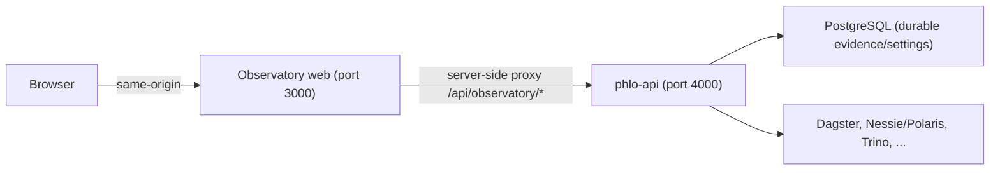

# Observatory operator runbook

This runbook covers installing and operating one Observatory deployment against
one Phlo project. The supported topology is **one project, one tenant, one
configured environment per deployment**. Do not point one Observatory at
multiple projects or switch `PHLO_PROJECT_PATH` on a running deployment.

## Architecture



The browser never talks to `phlo-api` or provider services directly. All
`/api/observatory/*` requests are proxied by the Observatory server-side runtime
to `PHLO_API_URL`. Provider hostnames (`phlo-api`, `nessie`, `trino`, `postgres`)
resolve only inside the compose network and never appear in browser payloads or
the client bundle — verify with `grep -r PHLO_API_URL dist/client` on a build.

## Install and start

```bash
phlo init my-lakehouse                 # or work in an existing project
cd my-lakehouse
phlo services init --profile api       # generates .phlo/ with compose + staged web build
phlo services start                    # or: --service postgres,phlo-api,observatory
phlo services status                   # readiness reporting per service
```

`phlo services init --profile api` stages the web build context into
`.phlo/web/` (Dockerfile, `package-lock.json`, `serve.mjs`, `src/`, config).
The compose entry builds `ghcr.io/phlohouse/phlo-observatory:<version>` from
that context via `npm ci` (lockfile-deterministic) and runs
`node serve.mjs` — the production entrypoint, not `vite preview`.

### Configuration

| Variable | Where | Meaning |
|---|---|---|
| `PHLO_API_URL` | container env (compose-managed) | Internal phlo-api base URL (`http://phlo-api:4000`). Server-side only. |
| `PHLO_API_BROWSER_URL` | `.phlo` env | Browser-facing phlo-api URL for rendered links (`http://127.0.0.1:4000` default). |
| `OBSERVATORY_PORT` | `.phlo` env | Host port mapped to container 3000 (default 3001). |
| `PHLO_API_PORT` | `.phlo` env | Host port for phlo-api (default 4000). |
| `HOST` / `PORT` | compose env | Bind interface/port inside the container (`0.0.0.0:3000`). |
| `NODE_ENV` | compose env | `production` in the installed service. |
| `PHLO_PROJECT_PATH` | phlo-api env | The project `phlo-api` reads; the mounted project root. |
| `PHLO_RUN_EVIDENCE_DB_URL` | phlo-api env | Postgres DSN for durable evidence/settings. Required for control-plane readiness — memory mode does not qualify. |
| `PHLO_OBSERVATORY_SETTINGS_BACKEND` | phlo-api env | `postgres` for real deployments. |
| `DAGSTER_GRAPHQL_URL`, `NESSIE_HOST`/`PORT`, `TRINO_HOST`/`PORT` | phlo-api env | Provider endpoints the API reads. |

Non-secret defaults live in `phlo.yaml` `env:` / `.phlo/overrides/.env`;
secrets live in `.phlo/secrets/.env` (generated per deployment). Never commit
secret material.

## Authentication and request safety

- `phlo-api` runs with `PHLO_AUTHORIZATION_MODE=required`; Observatory sends
  credentials same-origin (`credentials: "same-origin"`).
- Every mutation requires a CSRF token (`x-csrf-token` from
  `/api/observatory/csrf-token`) and a mandatory `Idempotency-Key`.
- Mutations record an intent audit row before dispatch and bind the idempotency
  key to the payload digest — replaying a key with a different payload is a 409.
- Sessions are cookie-based; the proxy preserves the `Set-Cookie` chain.

## Health and readiness

- Container healthcheck: `node -e 'fetch("http://127.0.0.1:3000/")…'` — liveness.
- `phlo services status` reports per-service health; `observatory` starts only
  after `phlo-api` is `service_healthy`.
- Readiness is deeper than liveness: the app's Platform page shows provider
  reachability and read/control readiness from `/api/observatory/platform/*`.
  A healthy process can still report `unavailable`/`partial` sources — that is
  truthful evidence, not a process failure.

## First run

1. Open `http://<host>:${OBSERVATORY_PORT}`.
2. The mission context banner shows the actual project and `environment_id` —
   verify it matches the intended project.
3. Datasets and Runs list real lakehouse state; empty projects show truthful
   `absent`/`empty` states, not demo data.
4. Launch work from a dataset page (materialize/backfill); the operation row
   records the idempotency key, intent audit, and dispatch outcome.

## Release flow

1. WAP candidates appear under Releases once a governed WAP run reports.
2. Open a candidate → Preview. The preview is digest-bound: it re-reads the
   target revision and quality evidence and reports blocking checks.
3. Confirm only after reviewing the digest; the promotion executor re-checks
   the digest inside the promotion lock, so a moved target aborts as
   `conflict`/`stale` rather than promoting the wrong bytes.
4. Outcomes: `promoted` (with `resumed: true` when an interrupted sequence was
   completed), `already_promoted` (a prior actor finalized it), `conflict`,
   `capability_unavailable`, `verification_pending`, `cleanup_pending`.
5. Verify consumer-visible state on the release row — released revision and
   per-table snapshot changes come from catalog evidence, not branch-name
   inference.

## Diagnosis

- **Run detail**: events/logs are attempt-scoped and cursor-paginated; quality
  reports show `NEVER_EVALUATED` truthfully.
- **Operations**: the Operations page lists journaled mutations. Non-terminal
  operations survive journal compaction.
- **Degraded sources**: a card showing `unavailable`/`stale`/`partial`/`corrupt`
  is reporting provider truth; check phlo-api logs and provider health rather
  than restarting Observatory.

## Unknown-outcome recovery

If a mutation's outcome is unknown (timeout mid-dispatch, API restart), the
idempotency claim stays unresolved rather than being assumed lost:

- `phlo-api` reconciles unresolved claims against provider evidence at startup
  and periodically when the operations list is read.
- Re-sending the same idempotency key replays the recorded outcome once the
  claim resolves — it never double-executes.
- Claims aborted before provider dispatch are marked `safe_to_retry`; those may
  be resubmitted under a new key.
- Never treat an unresolved claim as "didn't happen": check provider state
  (runs list, WAP reports) before retrying under a new key.

## Upgrade

1. Back up durable state first: the Postgres volume holding
   `PHLO_RUN_EVIDENCE_DB_URL` (e.g. `pg_dump`) **and** the project's `.phlo/`
   directory (WAP reports, operation journal). Schema migrations must not run
   against unbacked-up stores.
2. Bump the image tag / regenerate: `phlo services init --force --profile api`
   refreshes the staged build context and compose.
3. `phlo services start --build` (or pull the pinned image), then
   `phlo services status`.
4. State changes are additive and versioned where possible; the changelog/
   release notes must document any state shape that an older binary cannot
   read. If a release introduces such a shape, the runbook for that release
   marks it `backward-incompatible` and prescribes the downgrade path.

## Application rollback

Rollback means redeploying the previous image tag and compose:

```bash
phlo services stop
# restore .phlo/ state if the upgrade migrated it
phlo services start            # with the previous image tag
```

Rollback of the **application** restores the old code. It does **not** reverse
lakehouse mutations: promoted releases, merged WAP branches, materialized data
and truncated tables are real catalog/data-plane changes that persist
regardless of which Observatory/phlo-api version runs. Never present a UI
rollback as undoing a release — use the release evidence (WAP reports, catalog
revisions) to plan any data-level reversal deliberately.
