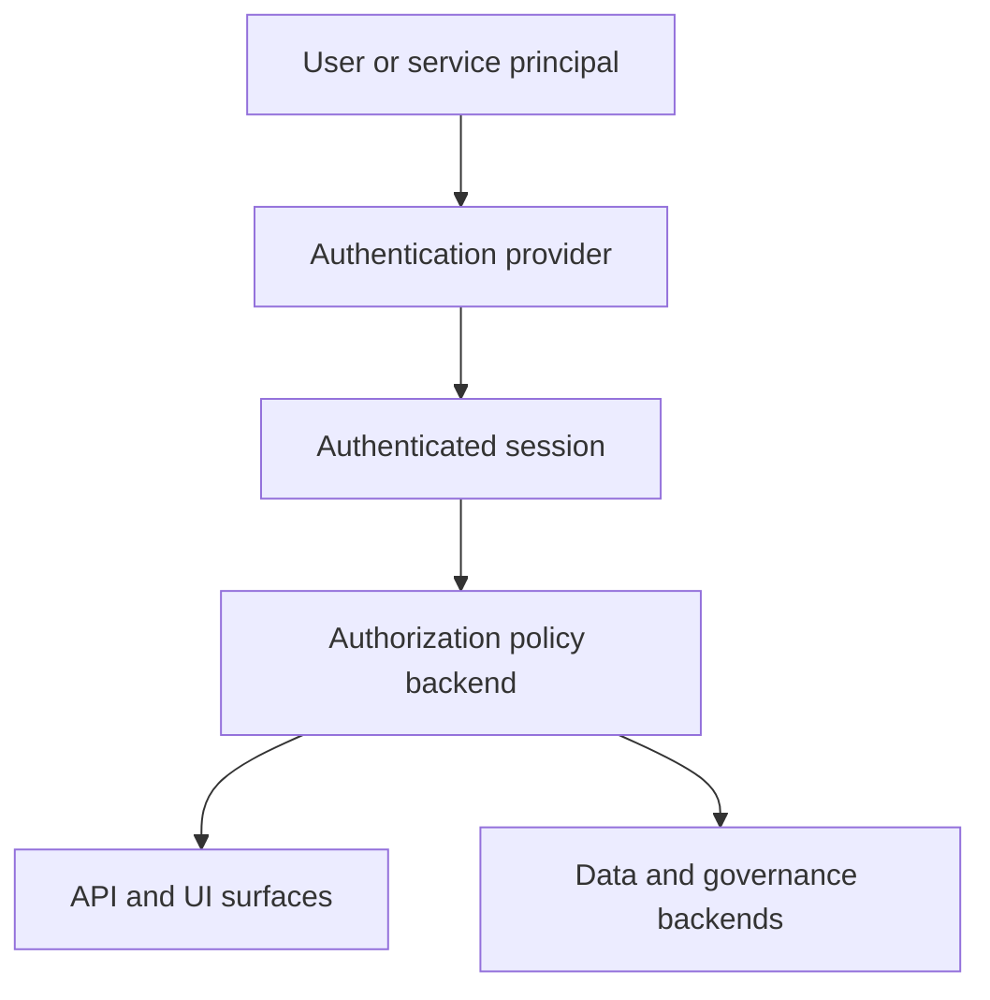
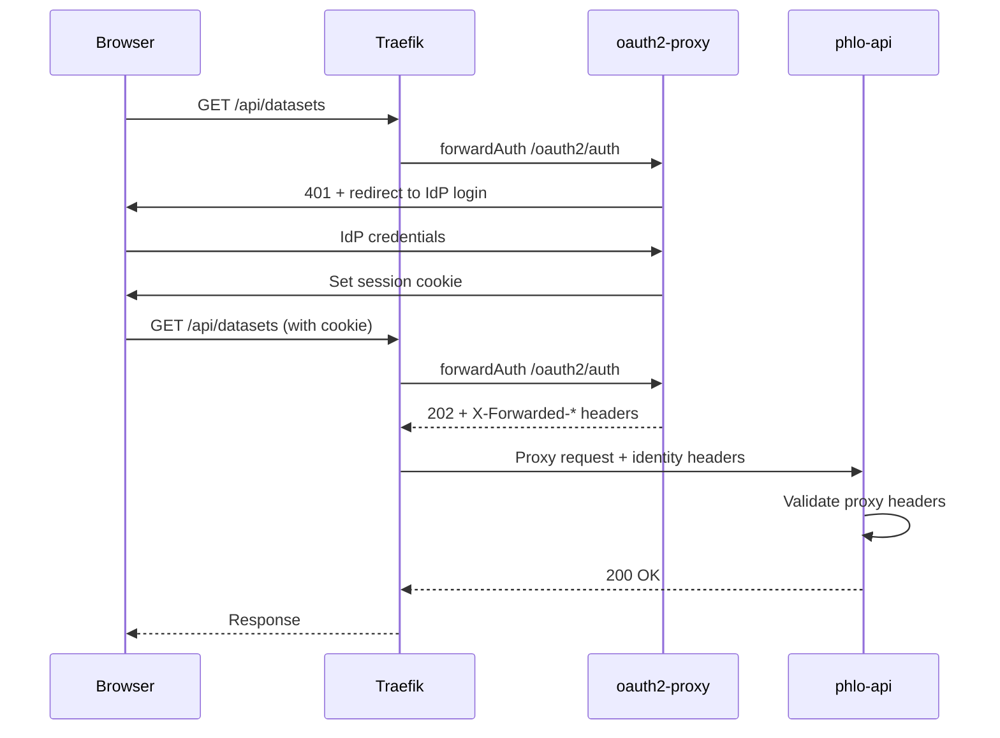

# Auth and access reference

Authentication and authorization in Phlo are layered.

## Target regulated model

Phlo's target regulated posture is an end-to-end chain instead of a single `phlo-api` concern. The current alpha release remains subject to the blocked [v1 support boundary](../../registry/support/v1.json).

The model now connects:

- caller authentication at the edge
- canonical action enforcement at supported request surfaces
- service-to-service identity for internal hops
- platform identity for autonomous Dagster daemon work
- backend-native credentials and grants in the data plane

That means a regulated request can now stay attributable from ingress all the way to backend query and object-store activity, provided you configure the service credentials and ingress boundary described in the setup docs.

## Model



## Responsibilities

- authentication decides who the caller is
- authorization decides what that caller may do
- serving layers like `phlo-api`, `Hasura`, and `PostgREST` enforce those decisions in different ways
- governance and backend systems may apply their own secondary controls

## Principal Types

| Type | Subject pattern | When used |
|------|-----------------|-----------|
| `user` | `alice@example.com` | Human via IdP, proxy headers, or JWT |
| `service` | `service:phlo-api` | Named service calling another service |
| `platform` | `platform:dagster-daemon` | Autonomous execution with no live human request |

Regulated mode accepts all three types. `platform` exists so scheduled and sensor-driven Dagster runs remain attributable even when no HTTP request is involved.

## Service Identity And Correlation

Internal service calls should use short-lived HMAC service tokens, not spoofable identity headers. Phlo uses:

- `Authorization: Bearer <service-token>` for the calling service identity
- `X-Phlo-Initiator` for the originating upstream principal when one exists
- `X-Phlo-Correlation-Id` for end-to-end audit reconstruction

`phlo-api` reuses the request ID as the default correlation ID. Dagster daemon flows use the Dagster `run_id` for the same purpose.

## End-to-end regulated path

For the target regulated deployment model, the path is:

1. A user authenticates at ingress or through a configured API auth provider.
2. A control-plane surface such as `phlo-api`, the CLI, or Dagster GraphQL maps the request to a canonical action and resource.
3. Phlo evaluates that action with `enforce()` and emits audit metadata.
4. Downstream service calls carry service identity and correlation headers.
5. Backends such as Trino, PostgreSQL, MinIO, and Nessie see the scoped service credential rather than one shared superuser identity.

If one of those layers is missing, the deployment is only partially regulated.

## phlo-api Route Guard Semantics

- `phlo-api` route guards only enforce authorization when an authorization backend is configured
- with the default `PHLO_AUTHORIZATION_MODE=optional`, guarded routes remain reachable when `PHLO_AUTHORIZATION_BACKEND` is unset
- set `PHLO_AUTHORIZATION_MODE=required` to fail closed with HTTP `503` on guarded routes when no authorization backend is configured
- once a backend is configured, route guards evaluate the caller normally and still return `401` or `403` based on authentication and policy decisions
- regulated mode itself can be enabled with `PHLO_REGULATED=true` or `regulated: true` at the root of `phlo.yaml`

Example:

```yaml
regulated: true

authentication:
  provider: proxy

api:
  authorization:
    backend: opa
    mode: required
```

Built-in authentication provider names include `static`, `proxy`, and `service_token`. Their built-in config blocks live under the same root `authentication` section in `phlo.yaml`.

## Agent and MCP token scopes

Agent-facing `phlo-api` routes require explicit bearer-token scopes. Tokens may come from the configured authentication provider, or from the local `PHLO_API_TOKENS` JSON object for single-project development and MCP use:

```bash
export PHLO_API_TOKENS='{
  "agent-token": {
    "subject": "agent:amp",
    "scopes": ["lakehouse:read", "lakehouse:operate", "project:write"]
  }
}'
```

| Scope | Grants | Examples |
|---|---|---|
| `lakehouse:read` | Read-only inspection | status, logs, traces, assets, schemas |
| `lakehouse:operate` | Data-plane mutations | materialize, retry, cancel, backfill |
| `project:write` | Project filesystem authoring | create workflow, validate workflow/schema, lint project |
| `admin` | All scoped operations | operator break-glass and local automation |

Mutation routes also enforce per-subject rate limits, write JSONL audit records to `.phlo/audit/operations.jsonl`, and honour idempotency keys for repeat-safe operation replay.

You can declare these settings in `phlo.yaml` as either:

```yaml
api:
  authorization:
    backend: opa
    mode: required
```

or, for a service-scoped override:

```yaml
services:
  phlo-api:
    authorization:
      backend: opa
      mode: required
```

Precedence is `env vars` -> `services.phlo-api.authorization` -> `api.authorization`.

## Proxy Authentication Flow

For production deployments, Traefik + oauth2-proxy provides browser SSO:



Identity headers passed to phlo-api:

- `X-Forwarded-User` - authenticated user identifier
- `X-Forwarded-Email` - authenticated user email
- `X-Forwarded-Groups` - comma-separated group list

Configure trusted proxies in `phlo.yaml`:

```yaml
authentication:
  provider: proxy
  proxy:
    trusted_proxies:
      - 172.16.0.0/12
```

## What Phlo enforces vs what operators still own

| Concern | Phlo-owned | Operator-owned |
|--------|------------|----------------|
| Canonical action mapping on `phlo-api`, CLI, Dagster | Yes | No |
| Dagster daemon platform identity | Yes | No |
| Service token format and validation | Yes | No |
| Ingress authentication for browser-only surfaces | No | Yes |
| Hasura/PostgREST/Superset internal permission models | No | Yes |
| Backend role creation, secret rotation, retention posture | Partial | Yes |

This split is deliberate. Phlo owns the control plane it can interpret directly. Operators still own the ingress boundary, optional surfaces without a Phlo adapter, and backend security operations.

## Canonical RBAC

Phlo's canonical RBAC control plane lives under `.phlo/authorization/` and provides a single model for roles, subject assignment, policy validation, backend planning, sync, and drift verification.

- source-of-truth files: `.phlo/authorization/roles.yaml` and `.phlo/authorization/policies.yaml`
- control commands: `phlo authz validate`, `phlo authz plan`, `phlo authz sync`, and `phlo authz verify`
- canonical RBAC currently supports `allow` policies only
- canonical `deny` rules are rejected by validation and backend compilation

The canonical RBAC files and commands are part of the authorization control plane.

## Current configuration model

The core authorization model is represented by `ApiAuthorizationConfig`. Its fields are `backend` and `mode`. `mode` accepts `optional` and `required`. An API route guard uses the configured backend when present. Required mode treats a missing backend as unavailable authorization configuration.

Service overrides use the same authorization fields under `infrastructure.services.<name>`. The core configuration schema does not define an identity-provider user store, token issuer, tenant directory, or external ingress policy.

## Authorization boundary

Phlo evaluates authorization context at supported API and Observatory surfaces. Operators configure identity providers, token signing keys, secret storage, TLS, network ingress, tenant provisioning, role assignment, and service credentials.

## Where to look

The configuration model is in [Configuration](configuration.md). Package ownership and the API and Observatory surfaces are in [Package reference](packages.md).
