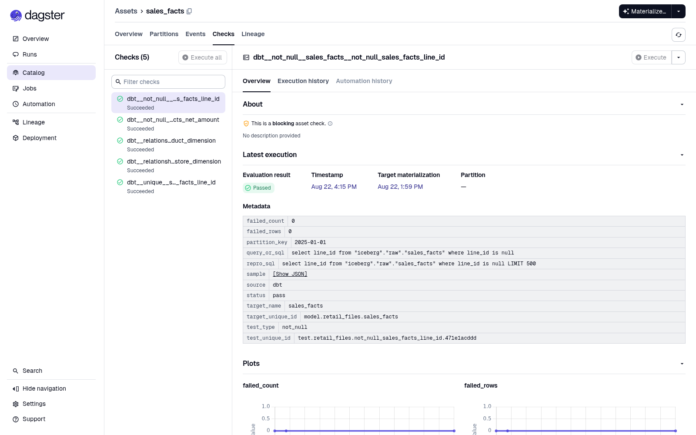

# From retail files to promoted Iceberg tables

The Retail Files example started with a deliberately ordinary question: what
happens when a real batch lakehouse—not a hello-world pipeline—meets Phlo's
public interfaces?

The answer is a standalone project that turns deterministic retail files into
12 Iceberg tables. DLT ingests five assets, dbt builds seven transformations,
Dagster orchestrates daily partitions and native quality checks, and Phlo's
write-audit-publish (WAP) lifecycle isolates every write on its own Nessie
branch before promotion.

This is an end-to-end result, not a direct provider demo. Every write described
below was launched with `phlo materialize` or `phlo backfill`.

## A standalone lakehouse

The example is intentionally self-contained. It owns its Python environment,
deterministic fixtures, workflow configuration, transformations, quality
checks, and local lakehouse services. After installing its dependencies, it can
run without external data sources or credentials.

That boundary makes it useful as both a learning project and a repeatable
reference implementation: copy it, generate the same inputs, and observe the
same tables and business results.

## The scenario

The default deterministic generator produces:

- 25 stores and 500 products;
- 30 daily partitions;
- 750 per-store/day CSV files containing 60,000 sales lines;
- 375,000 NDJSON inventory snapshots;
- JSON product, store, and promotion reference data; and
- a Parquet sales archive.

Five independently configured DLT assets ingest those files. Seven dbt assets
then build product and store dimensions, sales facts, a deduplicated inventory
balance, daily store metrics, category performance, and stockout/reorder
outputs.

```text
┌──────────────────────────────┐
│ CSV · JSON · NDJSON · Parquet│
└──────────────┬───────────────┘
               ▼
┌──────────────────────────────┐
│ 5 DLT ingestion assets       │
│ Pandera + business contracts │
└──────────────┬───────────────┘
               ▼
┌──────────────────────────────┐
│ WAP branch · Iceberg · Nessie│
└──────────────┬───────────────┘
               ▼
┌──────────────────────────────┐
│ 7 dbt transformation assets  │
│ native Dagster asset checks  │
└──────────────┬───────────────┘
               ▼
┌──────────────────────────────┐
│ Publish safely · query Trino │
└──────────────────────────────┘
```

Dagster discovers all seven transformation assets as daily-partitioned assets:


The source behaviors are intentionally different. Sales lines and reference
records use stable merge keys, while inventory is an append ledger. Replaying
inventory can therefore add raw rows; `inventory_balances` ranks ingestion
metadata and keeps the newest stable snapshot ID. That distinction exercises
idempotency where it belongs instead of pretending every source has the same
contract.

## What a successful publish looks like

The end-to-end scenario materializes `product_dimension` and `sales_facts` for
partition `2025-01-01`.

| Asset | Partition | Quality result | Publication result |
|---|---|---|---|
| `product_dimension` | `2025-01-01` | Passed | Promoted |
| `sales_facts` | `2025-01-01` | Five checks passed | Promoted |

Each asset writes to an isolated version of the catalog. Once the run and its
quality checks succeed, Phlo promotes the result atomically and removes the
temporary source branch.

This sequence is the important WAP guarantee: Dagster success is necessary but
not sufficient. Phlo validates the immutable launch manifest and native asset
check evidence, promotes the branch, persists the durable report, and only then
considers the lifecycle complete.

## Native quality evidence

The final `sales_facts` run emitted five successful Dagster
`AssetCheckEvaluation` events owned by that asset:

- not-null checks for `line_id` and `net_amount`;
- uniqueness for `line_id`; and
- relationships from `store_id` and `product_id` to their dimensions.

The checks are dbt tests, but they are not hidden in dbt's artifact directory.
They appear as native Dagster checks with query, failed-row count, partition,
and reproduction metadata. The screenshot shows all five succeeded and the
selected execution passed with zero failed rows.



Checks stay attached to the asset they describe. Materializing a dimension does
not accidentally execute or report a relationship check owned by
`sales_facts`.

## The resulting lakehouse

The published catalog contained 12 tables:

| Table | Rows |
|---|---:|
| `retail_products` | 500 |
| `retail_stores` | 25 |
| `retail_promotions` | 2 |
| `retail_inventory` | 12,560 |
| `retail_sales_lines` | 4,000 |
| `product_dimension` | 500 |
| `store_dimension` | 25 |
| `sales_facts` | 4,000 |
| `inventory_balances` | 12,500 |
| `daily_store_mart` | 50 |
| `product_category_performance` | 120 |
| `stockout_reorder` | 12,500 |

The 60 extra raw inventory rows are intentional replay history; the curated
balance remains deduplicated at 12,500 rows. For store `S001` on `2025-01-01`,
the deterministic daily mart returned 80 lines, 40 transactions, gross
6,100.80, discount 62.84, tax 483.03, and net 6,520.99.

Those assertions cross the whole stack: generated files, DLT loading, Iceberg
commits, Nessie promotion, dbt SQL, and Trino queries.

## Backfill means lifecycle completion

A two-day sales backfill ran sequentially with `--parallel 1`. Both partitions
promoted and removed their temporary branches. The second partition started
from the catalog state published by the first.

That ordering prevents a later partition from building on stale data. If the
process is interrupted, `--resume` continues the accepted in-flight run instead
of launching a duplicate.

The opposite path was exercised too. A missing partition exhausted its
configured retries and ended with a durable failed WAP report. Published data
did not change, and the isolated source remained available for the configured
audit-retention period.

## Operational shape

The example registers five stopped-by-default schedules instead of one generic
cron: hourly inventory, nightly sales, daily transforms, weekly reference data,
and weekly full WAP reconciliation. The promotion and retention-cleanup sensors
run independently.


Different assets also carry different retry, timeout, freshness, owner,
consumer, SLA, validation, and write-mode settings. Those differences are part
of the example's contract, not decorative metadata.

## What this demonstrates

The project shows how the pieces of a production-shaped batch lakehouse fit
together without hiding provider behavior:

- source-specific ingestion contracts can share one orchestrated project;
- append history can remain available while curated models stay idempotent;
- dbt tests can become visible, actionable orchestration evidence;
- sequential backfills can publish each partition from the latest catalog
  state; and
- failed runs can preserve diagnostics without exposing partial data.

The result is small enough to run locally but broad enough to serve as a useful
starting point for a real file-based lakehouse.

## Reproduce it

From `examples/lakehouses/retail-files`:

```bash
uv sync --locked --group dev
uv run python scripts/generate_fixtures.py --scale default
uv run pytest -q tests
uv run phlo services init --force --no-dev
uv run phlo services start --build
uv run phlo doctor

uv run phlo materialize product_dimension --partition 2025-01-01
uv run phlo materialize sales_facts --partition 2025-01-01
uv run phlo catalog tables
```

See the [example README](../README.md) for the full ingestion order, backfill,
queries, expected failures, and shutdown command.

## Result

Example 1 is complete. It is deterministic, network-independent after package
installation, runnable as a real consumer, and green through Phlo's public
orchestration path. More importantly, it now demonstrates both halves of WAP:
good data publishes atomically, and bad runs terminate with durable evidence
without exposing partial results.
