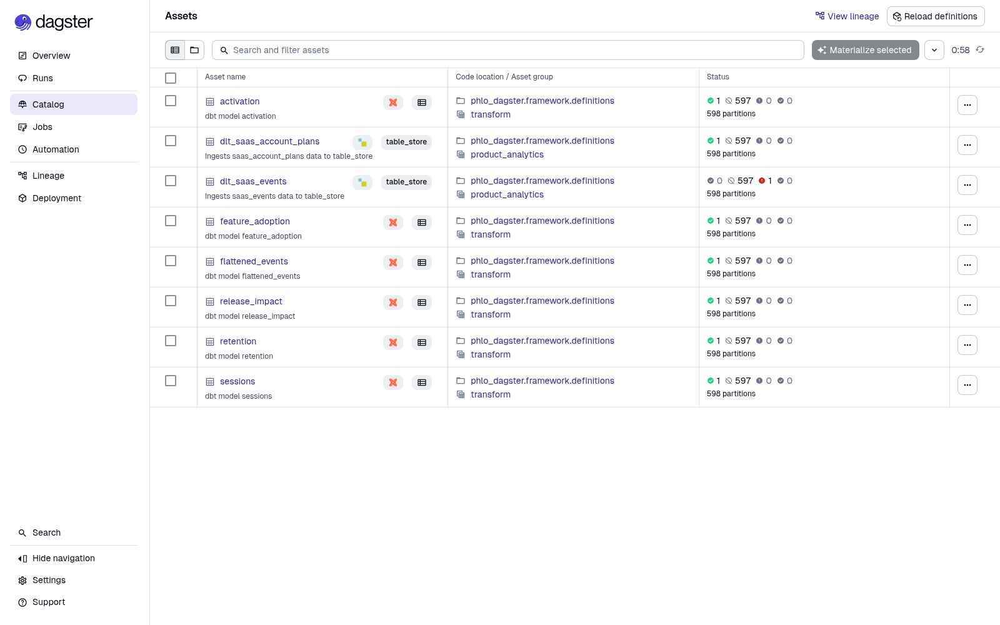
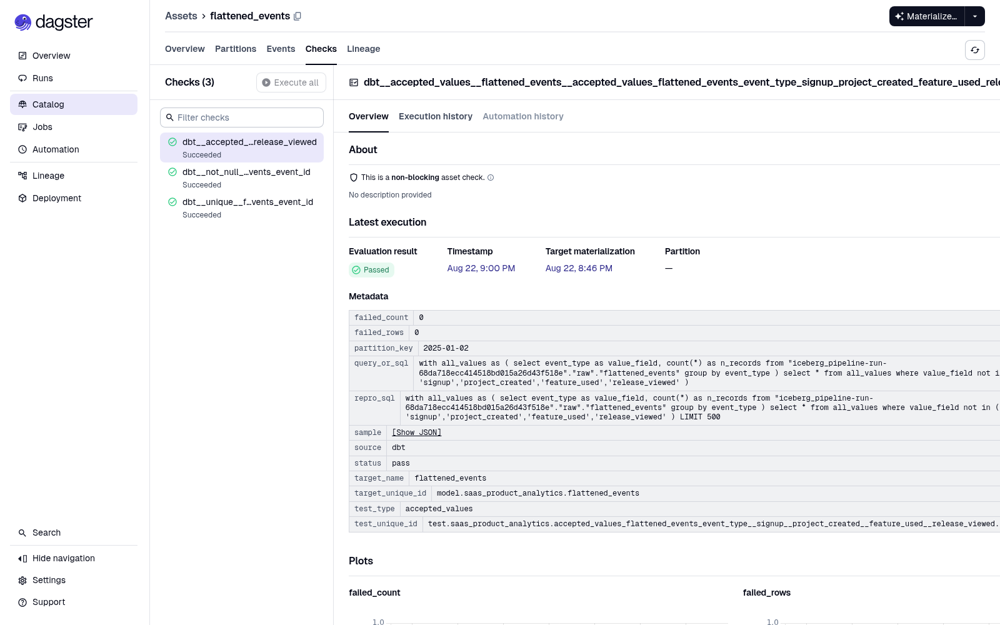
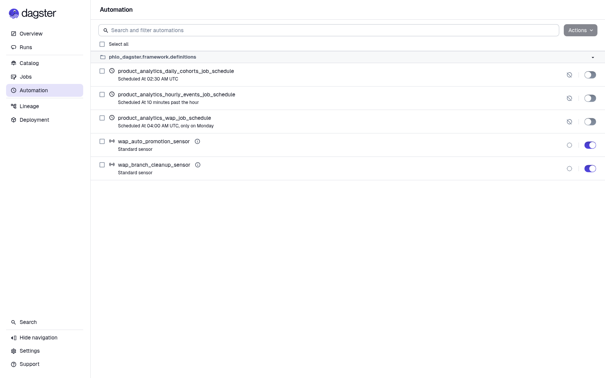

# From product events to trusted SaaS metrics

Product teams need more than a stream of click events. They need reproducible
answers to questions such as: Which accounts activated? Which features are
adopted? Do users return? This example turns a nested, paginated REST API and an
account-plan snapshot into eight governed Iceberg assets. DLT ingests and
normalizes the sources, Pandera enforces the event contract, dbt produces six
analytics tables, and Dagster makes checks and automation visible.

```text
┌──────────────────────────┐     ┌──────────────────────┐
│ Paginated events REST API│     │ Account-plan CSV     │
└────────────┬─────────────┘     └──────────┬───────────┘
             └──────────────┬───────────────┘
                            ▼
                  ┌───────────────────┐
                  │ DLT + Pandera     │
                  │ normalize & check │
                  └─────────┬─────────┘
                            ▼
                  ┌───────────────────┐
                  │ WAP-isolated      │
                  │ Iceberg raw data  │
                  └─────────┬─────────┘
                            ▼
                  ┌───────────────────┐
                  │ dbt models/tests  │
                  └─────────┬─────────┘
                            ▼
                  ┌───────────────────┐
                  │ Trusted product   │
                  │ analytics tables  │
                  └───────────────────┘
```

## A production-shaped input

The replay contains three pages and eight distinct events from three accounts.
Its middle page returns HTTP 429 once before succeeding, exercising the
ingestion retry policy rather than assuming a perfect source. Nested account,
actor, event, session, and release objects are normalized into an explicit
contract. Optional `feature` and `experiment_variant` fields remain nullable.

The account-plan snapshot contributes three plans. Event ingestion uses
`event_id` as its merge key, so replaying the source is idempotent: the published
table remains at eight rows and eight distinct IDs.



## Useful product answers

The six curated tables produce deterministic, inspectable results:

| Output | Result |
| --- | --- |
| `flattened_events` | Eight normalized events, ordered source timestamps, and nullable evolution fields |
| `sessions` | Four sessions: three events and two events for `acc-1`, two for `acc-2`, one for `acc-3` |
| `activation` | `acc-1` activated after creating a project; `acc-2` and `acc-3` did not |
| `retention` | 2025-01-01 cohort: two accounts on day 0 and one on day 1; 2025-01-02 cohort: one on day 0 |
| `feature_adoption` | `boards`: two events by one account; `automations`: one event by one account |
| `release_impact` | Release `2025.01` preserves those feature totals and records evolved-schema usage |

Session boundaries are deterministic because events are ordered by
`occurred_at` and then `event_id`. That makes repeated runs suitable for tests,
demos, and local experimentation—not merely screenshots.

## Quality evidence is part of the asset graph

Pandera rejects duplicate IDs, unsupported event types, malformed required
fields, and stale data before publication. dbt's not-null, unique, and
accepted-values tests are emitted as native Dagster asset checks owned by the
asset they validate. A successful `flattened_events` run records all three
checks as passed, including query and failed-row evidence.



## Safe API evolution without duplicate events

The baseline replay omits `experiment_variant` entirely. The evolved replay adds
`experiment_variant = 'treatment'` to one existing event. After rerunning the
events merge, the published result is still eight rows and eight distinct event
IDs, but exactly one row contains the new value. The downstream release-impact
table then reports one evolved-schema `boards` event. This is an actual
baseline-to-evolved transition, not a fixture that starts in the final shape.

## A failed source cannot become published truth

The failure fixture supplies an unsupported event type. The Dagster run fails
its blocking contract and the WAP report reaches terminal `failed` state with
reason `dagster_run_failed`. The main catalog hash and its eight-row event table
remain unchanged. The failed source branch and report stay available for audit;
only a successful checked branch can merge into the published catalog.

## Automation is present but opt-in

Three stopped schedules demonstrate an hourly event refresh (10 minutes past
the hour), daily cohort refresh (02:30 UTC), and weekly full publication (Monday
at 04:00 UTC). WAP promotion and cleanup sensors run alongside them. Keeping the
example schedules stopped prevents an example checkout from unexpectedly
launching work while still showing the production automation model.



Every successful materialization is isolated on a temporary Nessie branch. The
checks run against that isolated result, promotion merges it into `main`, and
cleanup removes the temporary source branch. The accepted end-to-end run
confirmed this lifecycle for both ingestions and all six transforms.

Follow the [README](../README.md) to run the baseline, evolve the optional API
field, and prove fail-closed publication locally.
